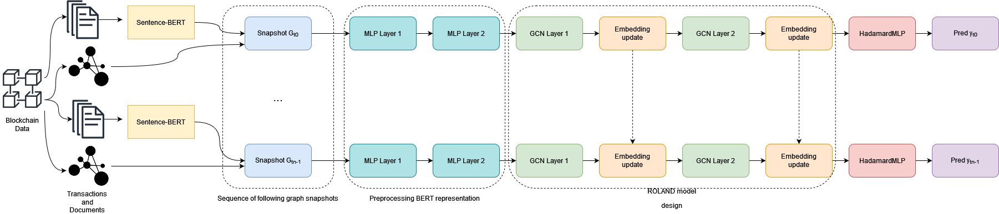

# T3GNN
In this repo, we present T3GNN (Temporal Graph Neural Network for Web3) to perform future transaction prediction on Web3 ecosystems.

## Description
In Web3 social platforms, i.e. social web applications which rely on blockchain technology to support their functionalities, interactions among users are usually multimodal, from common social interactions such as following, liking, or posting, to specific relations given by crypto-token transfers facilitated by the blockchain. In this dynamic and intertwined networked context, modeled as a financial network, our main goals are (i) to predict whether a pair of users will be involved in a financial transaction, i.e. the transaction prediction task, using textual information produced by users, and (ii) to verify whether performances may be enhanced by textual content. To address the above issues, we compared current temporal graph learning methods and developed T3GNN, a solution based on the ROLAND framework, which integrates sentence embeddings, for representing content, and historical negative sampling. We evaluated models in a Web3 context by leveraging a novel high-resolution temporal dataset, collected from one of the most used Web3 social platforms, which spans more than one year of financial interactions as well as published textual content. Apart from the best performances got by T3GNN, the experimental evaluation has shown that integrating textual features and embeddings did not significantly improve prediction performance, rather the replacement of text embeddings with random features surprisingly yielded better results in specific snapshots. Moreover, the evaluation has also highlighted the importance of adopting sampling methods alternative to random negative sampling when dealing with prediction tasks on temporal networks.

## Architecture Overview

The figure below shows the running pipeline of T3GNN. You can find the implementation of T3GNN in the `t3gnn.py` src file.  

.

## Steemit Data
Due to privacy reasons on personal data like username and textual content, we can't release the dataset related to Steemit. To patch this problem, we provide an anonymized version of our data. This version represents the final mathematical objects that are use to feed the models. For data gathering you can refer to the [Steemit API](https://developers.steem.io/) documentation.

## Experiments
### Reproduce
For the experiments presented in "Temporal graph networks and sentence embedding for transaction prediction in dynamic Web3 platforms", you can refer to the `T3GNN-Steemit.ipynb` notebook. Tu run it, you need first to install the requirements with:
```
pip install -r requirements.txt
```
### Additional information
We developed T3GNN using [Pytorch Geometric (PyG)](https://pyg.org/). For EvolveGCN and GCRN-GRU, we use the implementation available in [Pytorch Geometric Temporal](https://pytorch-geometric-temporal.readthedocs.io/en/latest/). We ran our experiments on NVIDIA Corporation GP107GL [Quadro P400]. In all our experiments, we use the Adam optimizer. This choice was made according to some prior works on GNN architecture for temporal networks (e.g. ROLAND, EvolveGCN). We adopt the live-update setting to train and evaluate the models, wherein we engage in incremental training and assess their performance across all the available snapshots. With respect to each snapshot, a random selection of 25\% of edges is employed to establish the early-stopping condition (validation set), while the remaining 75\% are utilized as the training set. The edges contained within the subsequent snapshot constitute the test set. Consistently, we apply identical dataset divisions and training procedures across all the methods. We report the configuration of hyperparameters for T3GNN in the following table: 

| Hyperparameter | Value |
|----------------|-------|
| Optimizer      | Adam  |
| Learning rate  | 0.01  |
| Weight Decay   | 5e-3  |
| Epochs         | 50    | 

Overall, computing all the experiments with all the baselines and a single configuration of hyperparameters takes no more than 20 minutes.
